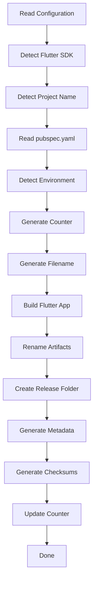

# flutter_build_manager

[](https://pub.dev/packages/flutter_build_manager)
[](https://opensource.org/licenses/MIT)
[](https://flutter.dev)

A production-ready Flutter Release Manager that automatically builds, renames, organizes, and tracks your Flutter release artifacts natively for macOS, Windows, Linux, iOS, and Android.

## Why use flutter_build_manager?

Managing Flutter releases manually is tedious, error-prone, and messy. Developers often struggle with:
- Forgetting to bump version numbers.
- Losing track of which APK or IPA was sent to QA.
- Overwriting previous builds in the `build/` folder.
- Inconsistent naming conventions across team members.
- Manually generating checksums and metadata for CI/CD.

**`flutter_build_manager` solves all of these problems.** It acts as an automated pipeline that strictly enforces a naming convention, dynamically tracks build counters across different environments (DEV, QA, LIVE), safely organizes output files into dated directories, and produces robust metadata and SHA256 checksums—all with a single command. 

Whether you are an indie developer aiming for better organization or an enterprise team orchestrating complex CI/CD pipelines, this package brings maturity and stability to your Flutter release process.

---

## Features

✅ **Automatic release artifact naming**: Stop naming files manually. Use dynamic templates.
✅ **Automatic build counter**: Track release sequences mathematically (e.g. `001`, `002`).
✅ **Daily counter reset**: Optionally reset your release counters every night at midnight.
✅ **Environment detection**: Seamlessly support `DEV`, `QA`, `UAT`, and `LIVE` tags.
✅ **Flutter Flavor support**: Automatically integrates with your existing Flutter `--flavor` setup.
✅ **`--dart-define` support**: Detects environments injected via Dart defines.
✅ **FVM support**: Automatically detects and uses your local `.fvm` Flutter SDK.
✅ **Flutter SDK auto-detection**: Falls back elegantly to global FVM or System Flutter.
✅ **Target Support**: Builds and tracks `APK`, `AAB`, and `IPA` natively.
✅ **SHA256 generation**: Automatically hashes your artifacts for security integrity.
✅ **Metadata generation**: Spits out a robust `release.json` detailing the build context.
✅ **Release history**: Never overwrite an artifact; safely stores logs and state counters.
✅ **Preview mode**: See exactly what a build will generate *before* you run it.
✅ **Custom filename templates**: Total control over the final file name.
✅ **Cross-platform support**: Built in native Dart to run flawlessly on macOS, Windows, and Linux.

---

## Installation

You can install `flutter_build_manager` either globally on your machine (recommended for CLI usage) or directly into your project as a dev dependency.

### Installation from GitHub

#### Global Activation (Recommended)

```bash
dart pub global activate -sgit https://github.com/thanseer02/flutter_build_manager
```

#### Add to an existing Flutter project

```yaml
dependencies:
  flutter_build_manager:
    git:
      url: https://github.com/thanseer02/flutter_build_manager
```

### Installation from Pub.dev (When Published)

#### Global Installation

```bash
dart pub global activate flutter_build_manager
```

#### Project Dependency

```bash
flutter pub add dev:flutter_build_manager
```

---

## Prerequisites

To utilize the full release pipeline, ensure your system meets the following requirements:
- **Flutter**: `>=3.30.0`
- **Dart**: `>=3.7.0`
- **FVM** *(Optional)*: Supported automatically if `.fvm` is present.
- **Android SDK**: Required for APK and AAB builds.
- **Xcode**: Required for IPA (iOS) builds on macOS.

---

## Quick Start

Transform your messy release process into a professional pipeline in seconds:

```bash
# 1. Initialize the configuration
flutter_release init

# 2. Preview what a release will look like (does not trigger a build)
flutter_release preview

# 3. Build and package your release!
flutter_release build apk
```

---

## How It Works

The manager does not simply wrap `flutter build`. It operates a strictly orchestrated, transactional 19-step pipeline that ensures your workspace remains pristine if an error occurs.



> [!IMPORTANT]  
> **Transactional Rollbacks:** If the pipeline fails during file generation (e.g., checksum fails), it will **automatically rollback and delete** the partially moved artifacts, ensuring your release directory stays perfectly clean!

---

## Using with Existing Flutter Projects

Integrating `flutter_build_manager` into a legacy project is completely non-destructive and requires zero code changes.

1. **Open project**: Navigate to your Flutter project root in your terminal.
2. **Run init**: Execute `flutter_release init`.
3. **Review**: Check the newly generated `flutter_release.yaml` and adjust preferences.
4. **Run preview**: Execute `flutter_release preview` to verify filename generation.
5. **Build release**: Execute `flutter_release build apk`.

---

## Using with FVM

`flutter_build_manager` has first-class support for Flutter Version Management (FVM).

If your project looks like this:
```
my_app/
  ├── .fvm/
  │    ├── fvm_config.json
  │    └── flutter_sdk/
  ├── pubspec.yaml
  └── flutter_release.yaml
```

The CLI will **automatically** detect `.fvm/fvm_config.json` and seamlessly route all compilation commands through your local FVM SDK. 

> [!NOTE]  
> The manager adheres to strict environments: It will **never** fall back to the system Flutter if it detects you have configured FVM for the project but forgot to run `fvm install`. It will intentionally throw a helpful error instead!

---

## Environment Detection

The manager automatically tags your builds with an environment (e.g. `LIVE`, `DEV`). It resolves this using a strict priority chain:

1. **Flutter Flavors**: If you pass `--flavor dev`, the environment is automatically set to `DEV`.
2. **Dart Defines**: If you pass `--dart-define=ENV=QA`, it resolves to `QA`.
3. **Configuration**: Uses the default configured in `flutter_release.yaml`.
4. **Manual override**: Passing `--env=STAGING` overrides everything else.

---

## Configuration

The `flutter_release.yaml` file controls the entire pipeline behavior. 

```yaml
release_manager:
  enabled: true
  output_directory: release
  template: "{project}_{date}_{env}_{counter}"
  build_counter:
    mode: daily
  organize_by:
    year: true
    month: true
    environment: true
```

| Property | Description |
|---|---|
| `enabled` | Master toggle for the release manager. |
| `output_directory` | The root folder where all releases are saved. |
| `template` | The dynamic filename template string. |
| `build_counter.mode` | Either `daily` (resets at midnight) or `continuous`. |
| `organize_by.*` | Toggles for generating nested folders (e.g. `release/2026/July/LIVE/`). |

---

## Filename Templates

Customize your artifact filenames using dynamic placeholders inside your `flutter_release.yaml` template string.

| Placeholder | Description | Example |
|---|---|---|
| `{project}` | The name of your Flutter project | `DriveReplay` |
| `{version}` | The semantic version from pubspec | `2.4.1` |
| `{flutter_build}` | The build number from pubspec | `35` |
| `{counter}` | The generated release sequence counter | `014` |
| `{date}` | Current date (yyyyMMdd) | `20260724` |
| `{time}` | Current time (HHmmss) | `143015` |
| `{env}` | Resolved environment | `LIVE` |
| `{platform}` | Target platform | `android` |
| `{year}` | Current 4-digit year | `2026` |
| `{month}` | Current full month name | `July` |

### Examples

With different templates, you can output:
- `DriveReplay_20260724_LIVE_001.apk`
- `DriveReplay_20260724_DEV_014.aab`
- `CRM_v2.4.1_QA_003.apk`

---

## Project Structure

When you execute a build, the manager safely isolates its outputs:

```
my_app/
  ├── .build_release/         # Internal state directory
  │    ├── state.json         # Tracks your active build counters
  │    └── logs/              # Daily execution logs
  │
  ├── release/                # Your beautiful output directory
  │    └── 2026/
  │         └── July/
  │              └── LIVE/
  │                   ├── DriveReplay_20260724_LIVE_001.apk
  │                   ├── DriveReplay_20260724_LIVE_001.apk.sha256
  │                   └── release.json
```

### Generated Files
- **`release.json`**: A comprehensive metadata snapshot containing file sizes, Flutter/Dart SDK versions used, timestamps, and environment data. Perfect for CI/CD ingestion.
- **`*.sha256`**: A cryptographic hash file validating the absolute integrity of your artifact.
- **Logs**: Daily rotated logs detailing build durations and any caught exceptions.

---

## Commands

| Command | Description |
|---|---|
| `flutter_release init` | Scaffolds the `flutter_release.yaml` configuration in your project. |
| `flutter_release preview` | Simulates a build outputting the exact filenames and paths without actually compiling anything. |
| `flutter_release build <target>` | Triggers the complete compilation and packaging pipeline for `apk`, `aab`, or `ipa`. |
| `flutter_release version` | Displays the current CLI version and your project's parsed pubspec version. |
| `flutter_release config` | Generates or modifies the configuration securely. |
| `flutter_release reset` | Safely resets build counters. |
| `flutter_release clean` | Safely cleans generated output paths. |
| `flutter_release doctor` | Validates your system dependencies against the CLI package. |

---

## Release History & Build Counters

The manager uses a smart counting system to ensure you can build multiple times a day without file conflicts.

If `build_counter.mode` is set to `daily` in your config, the counters automatically reset at midnight, giving you pristine `001` files every morning. It also strictly isolates counters by environment!

**Build Counter Examples:**
```
[Today]
LIVE -> 001
LIVE -> 002
DEV  -> 001

[Tomorrow]
LIVE -> 001
DEV  -> 001
```

---

## Troubleshooting

> [!WARNING]  
> **Flutter not found**
> Ensure `flutter` is in your system PATH, or that you have successfully run `fvm install` if using FVM.

> [!WARNING]  
> **FVM not found**
> FVM was detected in `fvm_config.json`, but the `.fvm/flutter_sdk` folder is completely missing. Run `fvm install` to fix it.

> [!WARNING]  
> **Malformed YAML / Missing pubspec.yaml**
> If your `flutter_release.yaml` or `pubspec.yaml` is malformed, the pipeline will immediately halt. Run your YAML through a linter.

> [!WARNING]  
> **Permission denied**
> Occurs if the CLI lacks write permissions to generate the `release/` directory. Relaunch your terminal as an Administrator, or fix your folder ownership.

> [!WARNING]  
> **Build failed**
> If Flutter compilation fails, the CLI will output the direct `stderr` logs from the compiler. Fix your Dart code and try again. The CLI guarantees it won't leave broken files in your release folder.

> [!WARNING]  
> **Invalid template**
> An unknown variable string like `{unknown}` was encountered in the `template` key. Review your `flutter_release.yaml`.

---

## FAQ

**1. Does this modify my project?**
No. It only reads your `pubspec.yaml` and creates a `.build_release/` and `release/` folder which you can safely add to your `.gitignore`.

**2. Can I customize filenames?**
Absolutely. Adjust the `template` key in `flutter_release.yaml`.

**3. Does it work with FVM?**
Yes! First-class FVM support is natively built in.

**4. Can I disable counters?**
Yes, simply remove `{counter}` from your template, though you may encounter file overwrites if you build multiple times in the same minute without `{time}`.

**5. Does it support CI/CD?**
Yes. Since it is a headless Dart CLI, it is highly recommended to run `flutter_release build apk` inside GitHub Actions or GitLab CI.

**6. Can I upload automatically?**
Not yet, but cloud upload integrations are on the roadmap!

**7. Will it overwrite releases?**
Never. If a file collision occurs, it automatically appends `_2`, `_3`, etc., keeping all past releases safe.

---

## Roadmap

We are continuously working to make this the ultimate Flutter release tool. Planned features include:
- [ ] Git integration (Automatic Tagging)
- [ ] Automatic Changelog Generation
- [ ] GitHub Releases API Integration
- [ ] Firebase App Distribution Upload
- [ ] Google Drive / S3 / Azure DevOps Upload
- [ ] Slack / Discord / Telegram Webhook Notifications
- [ ] CI/CD configuration presets (GitHub Actions)
- [ ] Windows `.exe` and macOS `.app` Desktop support

---

## Contributing

We welcome contributions! Please open an issue before submitting a major pull request. 
Ensure you adhere to standard Dart formatting (`dart format`) and maintain the 100% unit test coverage standard currently present in the repository.

---

## License

This project is licensed under the **MIT License**. See the LICENSE file for details.
